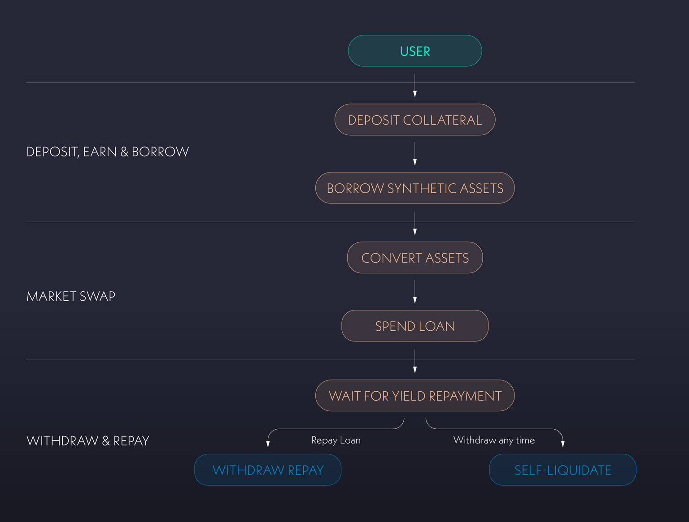
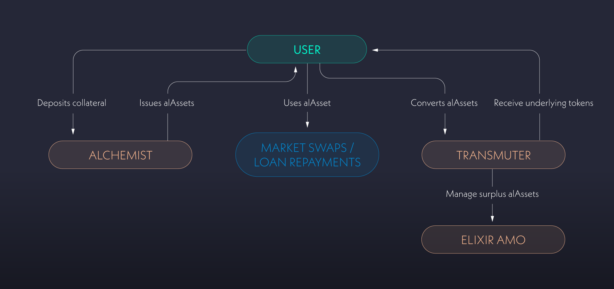
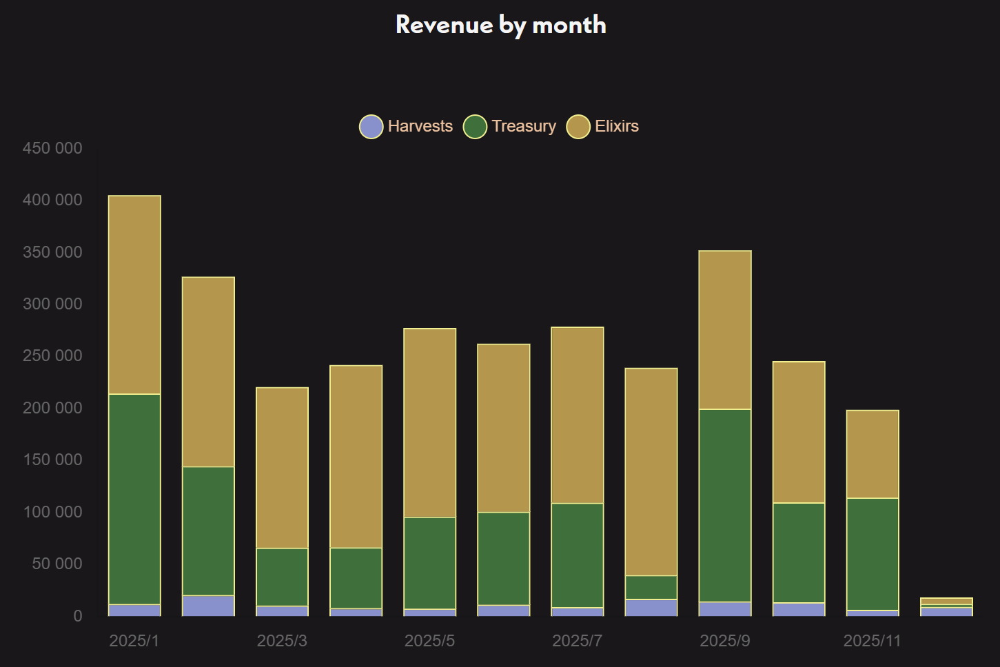
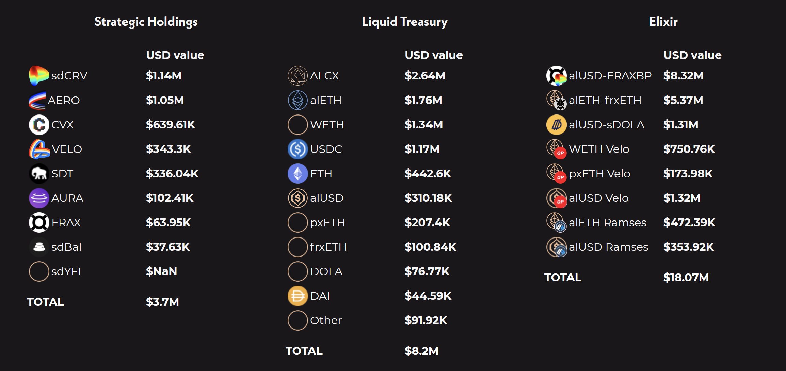

# Жидков Артем бпми226
# Исследовательский проект

```
├── images/            - Все используемые изображения
├── presentation.pdf   - Презентация для выступления
└── README.md          - Этот отчет
```

# Alchemix
## Основная идея протокола
### Какую задачу решает протокол?

Alchemix решает фундаментальную проблему DeFi-кредитования: как получить ликвидность, не продавая доходный актив и не рискуя ликвидацией. В классических lending-протоколах (Aave, MakerDAO):

1. Пользователь закладывает актив
2. Берёт заём
3. При падении цены залога может быть ликвидирован

Alchemix предлагает альтернативный подход: заём обеспечен не рыночной ценой залога, а будущей доходностью этого залога

Сам протокол работает так:
1. Пользователь вносит залог
2. Пользователь берет займ в размере до 0.5 от залога в виде альтернативных токенов
3. Пользователь может инвестировать их в сторонние сервисы, которые работают с al токенами. Или пользователь обменивает al токен на эквивалентный ему реальный токен и используем наш займ как хотим
4. Наш залог инвестируется в yeld стратегии
5. Доход который генерирует залог возвращает наш долг
6. Когда долг вернулся (или раньше если мы готовы отдать часть залога равную оставшемуся долгу)б можем забирать залог обратно

<p align="center">

</p>

### Для кого предназначен протокол?

Чтобы понять кому нужен этот протокол, можно воспользоваться таким flow-графиком:

<p align="center">

</p>

По сути Alchemix дает тебе твой Yiel вперед, под константный процент в виде коммиссии протокола на заработок с залога. Т.е. это более безопастный и выгодный заем

### В чём ключевая инновационность?

Ключевые инновации Alchemix:
* **Self-repaying loans**: Заём автоматически погашается со временем без участия пользователя
* **Отсутствие ликвидаци**: Вместо ликвидаций используется жёсткий лимит заимствования
* **Использование будущей доходности как обеспечения**: Пользователь фактически тратит будущий yield заранее

## Техническая архитектура и код
### Из каких основных смарт-контрактов состоит протокол? За что отвечает каждый ключевой компонент?

* **Alchemist** (smart contract) - основной смарт-контракт протокола Alchemix. Он принимает депозиты пользователей, управляет их долгами и выпускает соответствующие alAssets (имеет по одному уникальному Alchemist для alUSD и alETH)

* **Transmuter** (smart contract) - предназначенн для обмена alAssets на их базовый актив по курсу 1:1. Он используется для поддержания ценового пега alAssets и позволяет пользователям или протоколу конвертировать синтетические активы в реальные токены

* **Elixir AMO** (smart contract) — он управляет ликвидностью alAssets на внешних рынках, взаимодействует с пулами ликвидности и другими DeFi-протоколами, а также помогает стабилизировать курс alAssets и повышать эффективность капитала протокола

* **alAssets** (ERC-20 token) — представляют собой заём, обеспеченный будущей доходностью депозита. Такие токены, как alUSD или alETH, можно свободно использовать в экосистеме DeFi, при этом задолженность по ним постепенно погашается за счёт дохода, генерируемого протоколом, без необходимости ликвидаций

* **ALCX** (ERC-20 token) — токен управления протоколом. Он используется для голосования в AlchemixDAO, а также как токен стимулов, распределяемый участникам экосистемы за вклад в её безопасность и развитие

<p align="center">

</p>

### Какие есть основные операции и как они устроены?

Полный интерфейс: https://alchemix-finance.gitbook.io/v2/docs/ialchemistv2

```
deposit(address yieldToken, uint256 amount, address recipient)
```

- Эта функция принимает yield-bearing токен и зачисляет его на баланс указанного пользователя. Депозит начинает участвовать в стратегиях доходности, а получаемый yield в дальнейшем используется для автоматического погашения долга. Это базовая точка входа в протокол

```
depositUnderlying(address yieldToken, uint256 amount, address recipient, uint256 minimumAmountOut)
```

- Функция принимает базовый актив (например DAI), конвертирует его во внутренний yield-token через адаптер и затем депонирует. Она делает вход в протокол удобнее для пользователя, скрывая логику работы со стратегиями и защищая от проскальзывания через minimumAmountOut

```
mint(uint256 amount, address recipient)
```

- Эта функция выпускает alAsset (debt token) в указанном количестве и отправляет его получателю. В момент вызова создаётся долг пользователя, обеспеченный его депозитами

```
burn(uint256 amount, address recipient)
```

- Функция сжигает alAssets и уменьшает долг пользователя на соответствующую величину. Используется, когда пользователь напрямую возвращает синтетические токены протоколу, чтобы быстрее закрыть заём и освободить залог

```
repay(address underlyingToken, uint256 amount, address recipient)
```

- Позволяет погасить долг базовым активом, а не alAsset’ом. Внесённый underlying засчитывается как уменьшение долга пользователя, при этом применяются лимиты на объём погашения за период

```
withdraw(address yieldToken, uint256 shares, address recipient)
```

- Эта функция выводит часть депозита в виде yield-token’ов. Она проверяет, что после вывода позиция остаётся достаточно обеспеченной. Используется, когда пользователь хочет забрать залог, не конвертируя его обратно в базовый актив

```
withdrawUnderlying(address yieldToken, uint256 shares, address recipient, uint256 minimumAmountOut)
```

- Функция выводит депозит в виде базового актива. Внутри происходит конвертация yield-token в underlying через адаптер. Параметр minimumAmountOut защищает пользователя от неблагоприятного курса или потерь

```
harvest(address yieldToken, uint256 minimumAmountOut)
```

- Функция собирает доход со стратегий для конкретного yield-token. Полученный yield фиксируется протоколом и используется для погашения долгов пользователей. Это ключевой механизм, благодаря которому долг в Alchemix уменьшается со временем без действий пользователя

## Экономика и математика
### Как протокол зарабатывает?

Протокол в основном зарабатывает на комиссии с зарабатка от collateral. Распределение такое: 90% идет пользователю, 10% идет в казну. Дальнейшие траты из казны решаются голосованиями (DAO) и с 28 августа 2024ого ([[AIP 113] Initial Funding of the Alchemix Association](https://snapshot.box/#/s:alchemixstakers.eth/proposal/0x1af1e8118b989534fe0348553948a25eba8d62171acb8983da9e4a4543c1f702)), также Alchemix Association управляет асетами по контракту с DAO

Деньги из казны могут использоваться на много разных вещей:
* Оплата разработки и поддержки
* Аудиты безопасности
* Bug Bounty
* Стимулы для ликвидности и экосистемы
* Гранты для проектов использующих Alchemix
* Поддержка внешних инициатив и благотворительность

<p align="center">

</p>

Для голосования необходимо иметь ERC-20 token [ALCX](https://coinmarketcap.com/currencies/alchemix/). Общее количество токенов не ограничего, и они еженедельно минтятся для LP провайдеров

<p align="center">


</p>

Однако конечно надо понимать, что Alchemix сейчас большой протокол и имеет большую капитализацию, из-за этого на самом деле он также зарабатывает ещё на двух вещах:

1. Казна протокола - Она тоже не лежит без дела и генерирует доход который полность идет для протокола
2. Elixirs PVC - это механизм, через который пользователи временно передают ликвидность Alchemix, а Alchemix сам использует её в yield-стратегиях и забирает весь доход себе

<p align="center">

</p>

### Основная математика протокола

Основная фишка протокола в том, что ты берешь безпроцентный кредит. А значит можно заработать больше чем простым вложением (используем сложные проценты, которые для простоты выплачиваются бесконечно часто):

$C$ - изначальный капитал

$y$ - годовая доходность yield

$f$ - доля yeld идущая на погашение долга

$L$ - доля займа в Alchemix

$T$ - момент, когда долг полностью погашен

#### Просто yeld:

1. Вкладываем $C$ в yeld

$Total_{yeld} = С \cdot e^{yT}$

#### Реинвестирование залога Alchemix:

1. Вкладываем $C$ в Alchemix
2. Берем займ $LC$
3. Вкладываем займ в yeld

$Total_{alchemix} = C + СL \cdot e^{yT}$

#### Сравнение:

$T = \frac{L}{fy}$

$Total_{yeld} = Ce^{L/f}$

$Total_{alchemix} = C + CLe^{L/f}$

С учетом наших параметров ($L=0.5$ и $f=0.9$) Alchemix получается выгоднее

<p align="center">

</p>

## Основные риски
### Какие основные риски есть у протокола и его пользователей?

1. **Rug pull** - для Alchemix скорее правильнее говорить о soft rug / governance rug. Администрирование формально передано в DAO и все контракты публичны. Однако даже так возможно изменение ключевых параметров, которые могут эффективно заблокировать или потерять все твои токены (например переведя весь yeld в подконтрольную стратегию и затем сделать rug pull в ней)

2. **риск смарт-контрактов** - Alchemix использует много различных смарт контрактов и хоть они и публичны и проверялись тестами и аудитами, риск взлома никогда не исчезает. А взлом такого контракта может привести к полной потере средств

3. **риск стратегий доходности** - Для того, чтобы погашать кредит Alchemix перевод средства в yeld стратегии. Они в свою очередь не могут гарантировать доход. Всегда есть риск того, что стратегия уйдет в минус, или попросту будет взломана. В таком случае возможна частичная потеря пользовательских средств

4. **peg-риск alAssets** - alAssets не всегда обязаны торговаться строго по 1:1. Если Transmuter перегружен, а Elixir AMO не справляется с балансом ликвидности, цена alAsset может долгое время находиться ниже пега. Для пользователя это означает, что продать alAsset на рынке может быть невыгодно

5. **ликвидностный риск** - Даже если долг формально погашается yield’ом, пользователь может столкнуться с недостаточной ликвидностью на рынке или в Transmuter, если захочет быстро выйти из позиции или обменять alAsset на underlying

6. **временной риск** - Alchemix не гарантирует скорость погашения долга - она полностью зависит от доходности стратегий. Если ты взял долг и на момент взятия ожидалось, что он погасится через год, то если доходность упадет, долг может гаситься несколько лет

### Оценка риска

Стоит сказать, что Alchemix старается эти риски минимизировать, вот ключевые его стратегии:

1. Alchemix v2 прошёл полноценный аудит от Runtime Verification, с выявлением и исправлением проблем до деплоя в основной сети:
    * https://files.safe.de.fi/safe/files/audit/pdf/Alchemix_v2.pdf

2. Постоянное проведение соревнований и bug bounty по нахождению уязвимостей:
    * https://code4rena.com/reports/2022-05-alchemix?utm_source=chatgpt.com
    * https://immunefi.com/bug-bounty/alchemix/information/

3. Open source:
    * https://github.com/alchemix-finance

4. Для минимизации влияния плохой стратегии, Alchemix имеет запасные резервы и консервативные лимиты. Если какая-то стратегия начнет давать плохие результаты, то средства из неё выводятся и не вкладываются сверху, а потери возмещаяются пользователям из резервов, в случае, если стратегия потеряла залог пользователя

5. Также для минимизации импакта одной стратегии. Alchemix проводит постоянный отбор стратегий и инвестиции с открытим голосованиям по вложениям и старается диверсифицировать свои активы
    * https://alchemix-stats.com/
    * Примеры публичных голосований, по инвестициям:
    * [[AIP-117] Increase apxETH collateral cap to 1000](https://snapshot.org/#/s:alchemixstakers.eth/proposal/0x7f5704c5692c634839af9bc3dca5dd0f949e7a34f2523b67881e968cd0374577)
    * [[AIP-119] Invest in Den Technologies](https://snapshot.org/#/s:alchemixstakers.eth/proposal/0x0d3367f4bdb6a95ba3b1204b555b5226f64337d12fa9035983c06d51829debf8)

<p align="center">

</p>

6. Ежеквартальная публикация финансовых отчетов
    * https://docs.alchemix.fi/resources/audits-and-reports/financial-reports

7. Общая оценка безопастности внешними сервисами в районе 0.81
    * https://www.defisafety.com/app?title=Alchemix

8. Использование средств казны на поддержание экосистемы и обеспечения ликвидности (например гранты на проекты использующие alAssets и реинвестирование доли с прибыли в ликвидность)
    * https://alchemix.questbook.app/

9. Открытая стратегия дли ибежания потерь пользовательских ассетов
    * https://docs.alchemix.fi/resources/guides/vault-losses-and-collateral-de-pegging

## Сравнительный анализ
### Aave

Aave — один из крупнейших кредитных рынков DeFi: пользователи могут вносить активы под проценты и брать кредиты под залог, причём займы подлежат ликвидации при снижении LTV. Aave работает с множеством активов, предлагает переменные и фиксированные ставки, flash‑займы и инструменты управления рисками.

По сути это главный конкурент, если тебе нужен заем

сайт: https://aave.com/

### Pendle Finance

Pendle — это протокол токенизации будущей доходности: он разделяет yield‑bearing активы на два токена — Principal Token (PT) и Yield Token (YT). PT отражает базовый капитал, который можно продать или использовать, а YT представляет поток будущего дохода. Это делает будущий yield торгуемым

По сути позволяя пользователю как в Alchemix распоряжаться будущими доходами, но в немного другой структуре

сайт: https://www.pendle.finance/

### Экономическая модель

Alchemix

* Займ не требует классических процентов и не ликвидируется
* Долг гасится автоматом за счёт yield от стратегий
* Главный источник стоимости — доходность стратегий.

Pendle Finance

* Основная модель — торговля будущим доходом: пользователи могут продавать или страховать поток yield, а PT часто продаются с дисконтом, что создаёт рынки доходности
* Высокая потенция доходности, но сложнее правильно оценить риски

Aave

* Классическая модель кредитования с процентами для заёмщиков и доходом для поставщиков ликвидности
* Доход определяется балансом спроса/предложения и используется для стимулирования участия

### Главные риски

| Риск            | **Alchemix**                      | **Pendle**                               | **Aave**                                        |
| --------------- | --------------------------------- | ---------------------------------------- | ----------------------------------------------- |
| Рыночный риск   | Зависит от доходности стратегий   | Риск неправильной оценки будущего дохода | Волатильность активов влияет на риск ликвидации |
| Ликвидность     | Меньше прямой ликвидности alAsset | Может быть низкая ликвидность PT/YT      | Обычно высокая, но с риском slippage            |
| Риск ликвидации | Отсутствует                   | Отсутствует                                      | Есть - если LTV растёт выше лимита          |
| Сложность       | Средняя‑высокая                   | Высокая (двойные токены)                 | Средняя                                         |

### Доход

**Alchemix**
* Протокол берет фиксированный процент от сгенерированного дохода

**Pendle Finance**
* Комиссии за свопы
* Комиссии с YT‑дохода

**Aave**
* Процентная маржа
* Комиссии за транзакции
* Флеш‑кредиты
* Ликвидационные штрафы и дополнительные сборы

### Архитектура

**Alchemix**

- Система ориентирована не на прямое кредитование с процентами, а на композицию сторонних доход‑источников, автоматическое распределение yield и выпуск synthetic стабилкоинов или активов. Это скорее «yield engine + synthetic issuance»

**Pendle Finance**

- Pendle больше похож на товарно‑финансовый рынок yield‑деривативов: его смарт‑контракты позволяют разделять доходность и основную стоимость, а AMM обеспечивает торгуемость этих компонентов. Это не кредитный путь, а путь управления будущей доходностью как активом

**Aave**

- Aave ориентирован на глобальный пул ликвидности, который обслуживает множества отдельных рынков/активов и позволяет участникам легко заимствовать и давать в долг с управлением рисками и ликвидациями

### Сильные и слабые стороны **Alchemix**

Сильные стороны

* Самопогашающиеся займы без ликвидаций - долг постепенно уменьшается за счёт доходности депозита. Это значит, что коллатераль никогда не будет насильно ликвидирован из‑за падения рынка
* Экономия времени и простота для пользователя - Пользователю не нужно следить за маржинальными требованиями — доход генерируется и применяется автоматически. Это снижает необходимость ручного управления займом
* Получение ликвидности, сохраняя экспозицию к активам - Ты получаешь alUSD/alETH, не продавая свои активы, и сохраняешь экспозицию к их росту
* Инновационная экономическая модель - Использование будущей доходности как залога расширяет способы получения ликвидности без типичных рисков заёмщиков
* DAO‑управление и адаптивность - общеоткрытое управление стратегией

Слабые стороны

* Сильная зависимость от внешних стратегий yield - Доходность, которая гасит долг, приходит из сторонних платформ. Если стратегии дают низкий доход или ломаются, погашение может сильно растянуться или замедлиться
* Риск смарт‑контрактов и каскадные риски - Alchemix интегрируется с другими DeFi‑контрактами, что создаёт contagion risk
* Ограниченное практическое применение alAssets - Хотя alUSD/alETH торгуются и могут использоваться в других протоколах, их utility шире, чем просто займы, недостаточно выражена. Это может ограничивать спрос на alAssets
* Потенциальные сложности с пониманием механики - Для большинства пользователей концепция будущей доходности как залога может быть неинтуитивной и сложной, особенно в сравнение с прямыми займами в Aave/Compound
* Зависимость от рыночной эффективности peg‑поддержки - Чтобы alAssets держали близкий pegging к 1:1, протокол использует Transmuter и AMO. В условиях высокой волатильности или низкой доходности поддержание пега может оказаться дорогим или менее эффективным

## Официальные ресурсы

Alchemix official website, https://alchemix.fi/

Alchemix user docs, https://docs.alchemix.fi/

Alchemix developer docs, https://alchemix-finance.gitbook.io/v2/

Alchemix whitepaper, https://bennettftomlin.com/wp-content/uploads/2021/04/c76d1d663f6c8247b86a8fca83d5bd1b.pdf

Alchemix github, https://github.com/alchemix-finance

Alchemix AIPs, https://snapshot.org/#/s:alchemixstakers.eth/proposals

Alchemix bug bounty, https://immunefi.com/bug-bounty/alchemix/information/

Alchemix grants, https://alchemix.questbook.app/

Alchemix DAO, https://snapshot.org/#/s:alchemixstakers.eth
