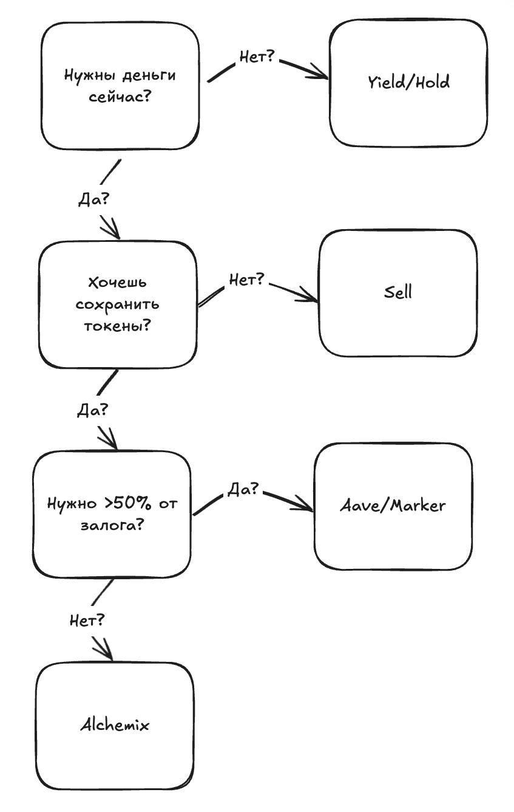
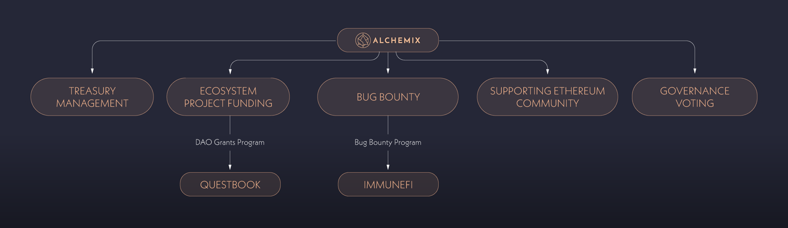
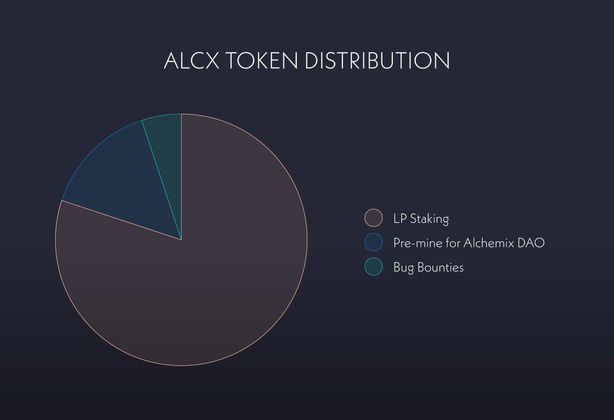
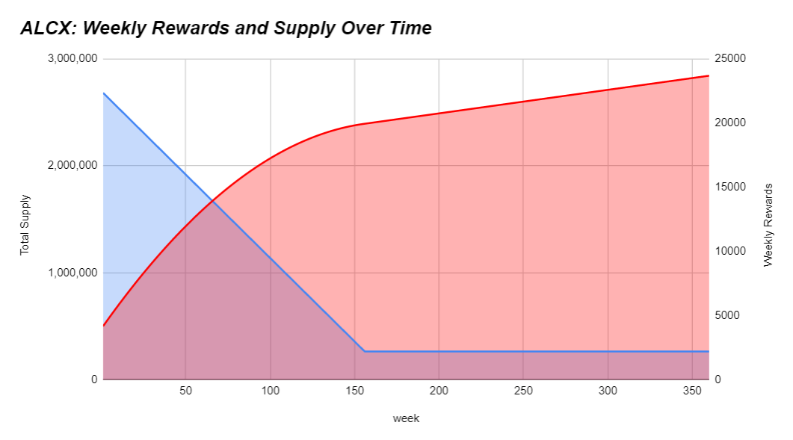
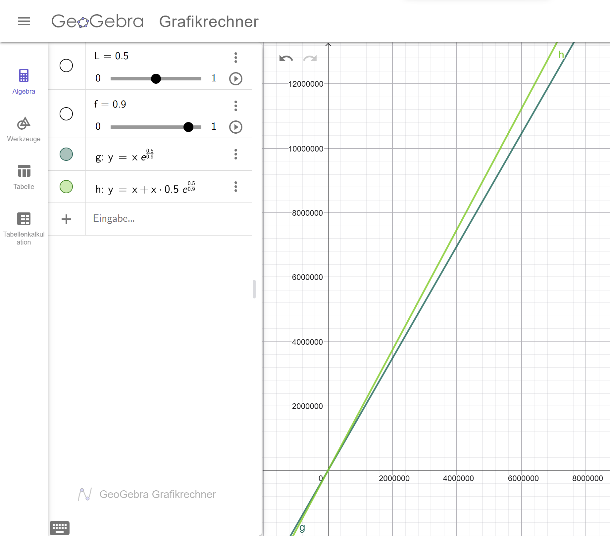

# Жидков Артем бпми226
# Исследовательский проект
# Alchemix

```
- images
```

## Основная идея протокола
### Какую задачу решает протокол?

Alchemix решает фундаментальную проблему DeFi-кредитования: как получить ликвидность, не продавая доходный актив и не рискуя ликвидацией. В классических lending-протоколах (Aave, MakerDAO):

1. Пользователь закладывает актив
2. Берёт заём
3. При падении цены залога может быть ликвидирован

Alchemix предлагает альтернативный подход: заём обеспечен не рыночной ценой залога, а будущей доходностью этого залога

### Для кого предназначен протокол?

Чтобы понять кому нужен этот протокол, можно воспользоваться таким flow-графиком:

<p align="center">

</p>

По сути Alchemix дает тебе твой Yiel вперед, под константный процент в виде коммиссии протокола на заработок с залога. Т.е. это более безопастный и выгодный заем

### В чём ключевая инновационность?

Ключевые инновации Alchemix:
* **Self-repaying loans**: Заём автоматически погашается со временем без участия пользователя
* **Отсутствие ликвидаци**: Вместо ликвидаций используется жёсткий лимит заимствования
* **Использование будущей доходности как обеспечения**: Пользователь фактически тратит будущий yield заранее

## Техническая архитектура и код
### Из каких основных смарт-контрактов состоит протокол? За что отвечает каждый ключевой компонент?

* **Alchemist** (smart contract) - основной смарт-контракт протокола Alchemix. Он принимает депозиты пользователей, управляет их долгами и выпускает соответствующие alAssets (имеет по одному уникальному Alchemist для alUSD и alETH)

* **Transmuter** (smart contract) - предназначенн для обмена alAssets на их базовый актив по курсу 1:1. Он используется для поддержания ценового пега alAssets и позволяет пользователям или протоколу конвертировать синтетические активы в реальные токены

* **Elixir AMO** (smart contract) — он управляет ликвидностью alAssets на внешних рынках, взаимодействует с пулами ликвидности и другими DeFi-протоколами, а также помогает стабилизировать курс alAssets и повышать эффективность капитала протокола

* **alAssets** (ERC-20 token) — представляют собой заём, обеспеченный будущей доходностью депозита. Такие токены, как alUSD или alETH, можно свободно использовать в экосистеме DeFi, при этом задолженность по ним постепенно погашается за счёт дохода, генерируемого протоколом, без необходимости ликвидаций

* **ALCX** (ERC-20 token) — токен управления протоколом. Он используется для голосования в AlchemixDAO, а также как токен стимулов, распределяемый участникам экосистемы за вклад в её безопасность и развитие

### Какие есть основные операции и как они устроены?

deposit(address yieldToken, uint256 amount, address recipient)

Эта функция принимает yield-bearing токен (например, Yearn vault token) и зачисляет его на баланс указанного пользователя. Депозит начинает участвовать в стратегиях доходности, а получаемый yield в дальнейшем используется для автоматического погашения долга. Это базовая точка входа в протокол.

depositUnderlying(address yieldToken, uint256 amount, address recipient, uint256 minimumAmountOut)

Функция принимает базовый актив (например DAI), конвертирует его во внутренний yield-token через адаптер и затем депонирует. Она делает вход в протокол удобнее для пользователя, скрывая логику работы со стратегиями и защищая от проскальзывания через minimumAmountOut.

mint(uint256 amount, address recipient)

Эта функция выпускает alAsset (debt token) в указанном количестве и отправляет его получателю. В момент вызова создаётся долг пользователя, обеспеченный его депозитами. Размер выпуска ограничен минимальной коллатерализацией и глобальными лимитами минта.

burn(uint256 amount, address recipient)

Функция сжигает alAssets и уменьшает долг пользователя на соответствующую величину. Используется, когда пользователь напрямую возвращает синтетические токены протоколу, чтобы быстрее закрыть заём и освободить залог.

repay(address underlyingToken, uint256 amount, address recipient)

Позволяет погасить долг базовым активом, а не alAsset’ом. Внесённый underlying засчитывается как уменьшение долга пользователя, при этом применяются лимиты на объём погашения за период.

withdraw(address yieldToken, uint256 shares, address recipient)

Эта функция выводит часть депозита в виде yield-token’ов. Она проверяет, что после вывода позиция остаётся достаточно обеспеченной. Используется, когда пользователь хочет забрать залог, не конвертируя его обратно в базовый актив.

withdrawUnderlying(address yieldToken, uint256 shares, address recipient, uint256 minimumAmountOut)

Функция выводит депозит в виде базового актива. Внутри происходит конвертация yield-token → underlying через адаптер. Параметр minimumAmountOut защищает пользователя от неблагоприятного курса или потерь.

harvest(address yieldToken, uint256 minimumAmountOut)

Функция собирает доход со стратегий для конкретного yield-token. Полученный yield фиксируется протоколом и используется для погашения долгов пользователей. Это ключевой механизм, благодаря которому долг в Alchemix уменьшается со временем без действий пользователя.

poke(address owner)

Принудительно обновляет состояние аккаунта пользователя, применяя накопленный yield к его долгу. Используется для синхронизации учёта перед чувствительными операциями вроде минта или вывода.

## Экономика и математика
### Как протокол зарабатывает?

Протокол в основном зарабатывает на комиссии с зарабатка от collateral. Распределение такое: 90% идет пользователю, 10% идет в казну. Дальнейшие траты из казны решаются голосованиями (DAO) и с 28 августа 2024ого ([[AIP 113] Initial Funding of the Alchemix Association](https://snapshot.box/#/s:alchemixstakers.eth/proposal/0x1af1e8118b989534fe0348553948a25eba8d62171acb8983da9e4a4543c1f702)), также Alchemix Association управляет асетами по контракту с DAO

Деньги из казны могут использоваться на много разных вещей:
* Оплата разработки и поддержки
* Аудиты безопасности
* Bug Bounty
* Стимулы для ликвидности и экосистемы
* Гранты для проектов использующих Alchemix
* Поддержка внешних инициатив и благотворительность

<p align="center">

</p>

Для голосования необходимо иметь ERC-20 token [ALCX](https://coinmarketcap.com/currencies/alchemix/). Общее количество токенов не ограничего, и они еженедельно минтятся для LP провайдеров

<p align="center">


</p>

### Основная математика протокола

Основная фишка протокола в том, что ты берешь безпроцентный кредит. А значит можно заработать больше чем простым вложением (используем сложные проценты, которые для простоты выплачиваются бесконечно часто):

$C$ — изначальный капитал

$y$ — годовая доходность yield

$f$ - доля yeld идущая на погашение долга

$L$ — доля займа в Alchemix

$T$ — момент, когда долг полностью погашен

#### Просто yeld:

1. Вкладываем $C$ в yeld

$Total_{yeld} = С \cdot e^{yT}$

#### Реинвестирование залога Alchemix:

1. Вкладываем $C$ в Alchemix
2. Берем займ $LC$
3. Вкладываем займ в yeld

$Total_{alchemix} = C + СL \cdot e^{yT}$

#### Сравнение:

$T = \frac{L}{fy}$

$Total_{yeld} = Ce^{L/f}$

$Total_{alchemix} = C + CLe^{L/f}$

С учетом наших параметров ($L=0.5$ и $f=0.9$) Alchemix получается выгоднее

<p align="center">

</p>

## Основные риски
### Какие основные риски есть у протокола и его пользователей?

## Сравнительный анализ
### Найдите 1–2 похожих протокола
### Сравните их по архитектуре, экономической модели, рискам
### Объясните, в чём сильные и слабые стороны выбранного протокола


## Источники

Alchemix official website, https://alchemix.fi/

Alchemix user docs, https://docs.alchemix.fi/

Alchemix developer docs, https://alchemix-finance.gitbook.io/v2/

DEFI SAFETY, https://www.defisafety.com/app?title=Alchemix

Alchemix whitepaper, https://bennettftomlin.com/wp-content/uploads/2021/04/c76d1d663f6c8247b86a8fca83d5bd1b.pdf

Alchemix github, https://github.com/alchemix-finance

Alchemix AIPs, https://snapshot.org/#/s:alchemixstakers.eth/proposals
